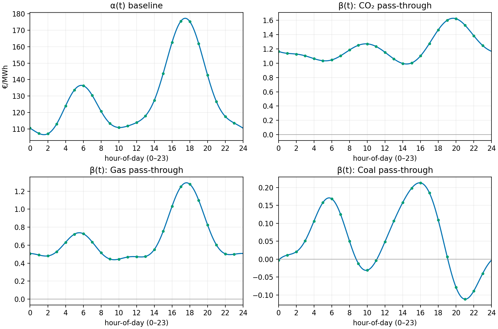
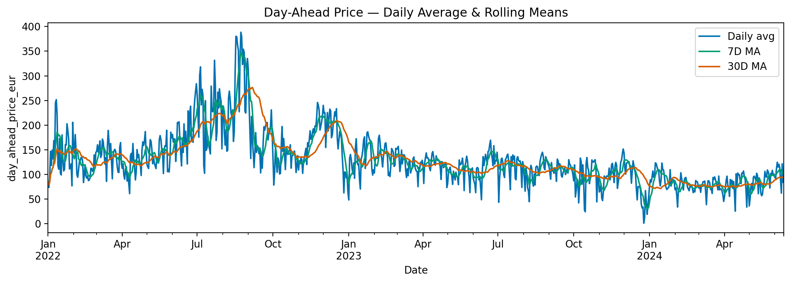
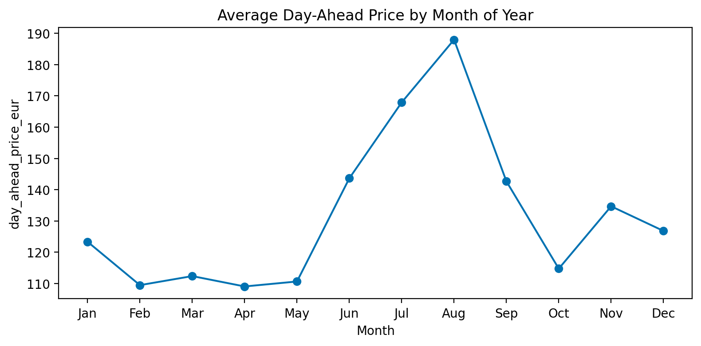
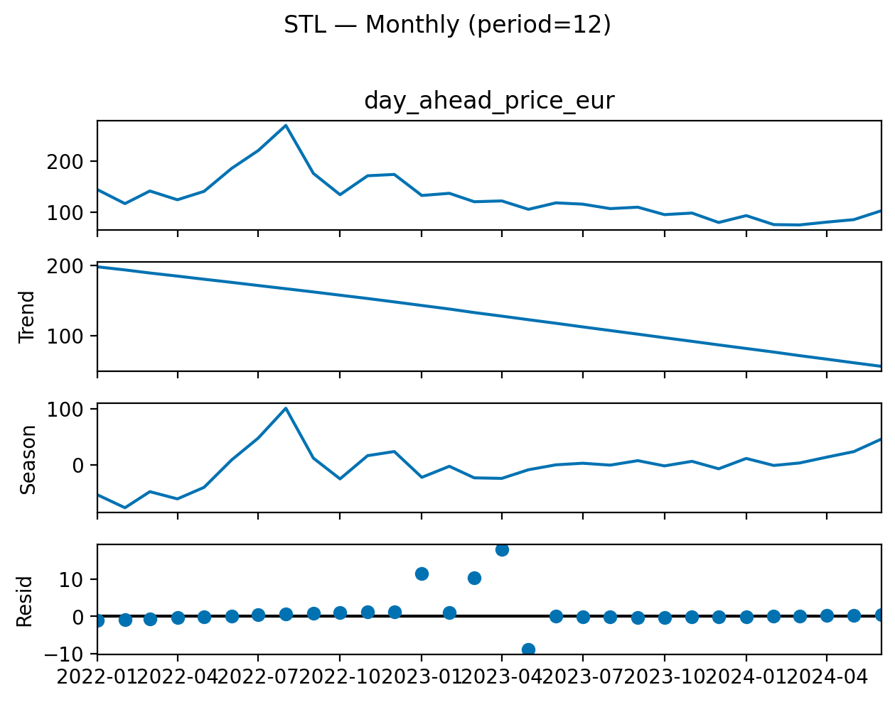
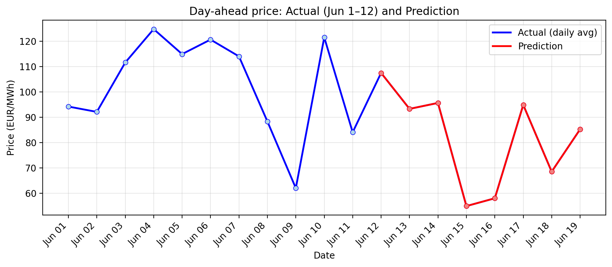

# Introduction & Data Preparation

**Dataset window:** 2022-01-01 00:00 → 2024-06-12 23:00 (UTC)

The data are consolidated into a single **hourly** table. All timestamps use **UTC**. An hourly time grid defines the index.

Each source is reindexed to this grid: day-ahead price, load, generation by technology, cross-border flows, commodity drivers (natural gas, coal, CO₂), and installed wind/solar capacity.

Lower-frequency or irregular series are upsampled with (first) forward fill and (then) back fill. Then, the sources are combined with outer joins.

Column names are cleaned. Units are standardized to **EUR/MWh** (power and gas), **EUR/ton** (coal and CO₂), and **MWh per hour** (load, generation, flows).

For trade flows, a positive `trade_balance` means **net imports**. Exports are negative.

The final dataset is `clean_data.csv`. It is used in Tasks 1–4. The code lives in `original_data/preprocess.ipynb`.

*Consistency note.* In real systems the hourly energy balance $$\text{Generation}+\text{Imports}-\text{Exports}-\text{Load}\approx 0$$ should be near zero. In this dataset it does not close. The likely cause is that the load series is a **day-ahead forecast**, plus small reporting noise. This was taken into consideration for task 4 specifically.

# Task 1 — Day ahead prices ~ commodities

> **Question:**  
> Suppose that you want to understand the influence that key commodities, i.e., prices of
> natural-gas, coal, CO2 allowances have on day-ahead prices. Model and quantify these
> relationships, and suggest a potential trading strategy based on your findings.

## Model
A **concurrent functional linear regression** is fitted.  
Each observation is a **curve** over a calendar axis (e.g., hour-of-day or month-of-year), not a single row as in OLS. The model can be expressed as: 
$$y_t(u)=\alpha(u)+\sum_j \beta_j(u)\,x_{j,t}(u)+\varepsilon_t(u)$$
 Here, $u$ is the calendar position (daily, monthly, quarterly, etc). The coefficients $\beta_j(u)$ are **smooth curves**. Each $\beta_j(u)$ is the **pass-through** at the *same* $u$: if gas moves by 1 unit at $u_0$, price moves by about $\beta_{\text{Gas}}(u_0)$ units at $u_0$, all else equal.  
**This differs from OLS:** OLS uses one fixed coefficient per driver. The functional model lets the coefficient vary smoothly with time-of-day or season, which is more interpretable for power markets.

---

## Figure A — Hour-of-day coefficient curves

**How to read the curves:**
- $\alpha(u)$ is the **baseline price** shape. It shows typical intraday levels without commodity shocks.  
  *Example:* baseline is low at night (~€105/MWh around 02:00), has a morning shoulder (~€135/MWh around 06:00), and a strong evening peak (~€175–€180/MWh around 18–19).
- $\beta_{\text{Gas}}(u)$ is the **gas pass-through** by hour.  
  *Example:* $\beta_{\text{Gas}}(18)\approx 1.25$. If gas rises by €1/MWh at 18:00, the day-ahead power price at 18:00 rises by ≈€1.25/MWh (ceteris paribus). Around 06:00 it is ≈0.7; around 23:00 ≈0.5. Gas matters **more** in the evening peak.
- $\beta_{\text{CO2}}(u)$ is the **carbon pass-through** by hour.  
  *Example:* around 20:00 it peaks near ≈1.6; before dawn it is closer to ≈1.0. A higher carbon price lifts peak-hour power more, which is consistent with carbon-intensive units setting the margin in peak.
- $\beta_{\text{Coal}}(u)$ is the **coal pass-through** by hour.  
  It is small for most hours (near zero), slightly positive in late afternoon (~0.2), and near zero or slightly negative late evening. Coal is a **second-order** driver in this sample for intraday moves.

**What positive/negative/zero mean at hour $u$:**
- **Positive** $\beta_j(u)>0$: an increase in driver $j$ raises the day-ahead price **at the same hour**.  
- **Negative** $\beta_j(u)<0$: an increase in driver $j$ lowers the price at that hour (can happen if another correlated factor dominates).  
- **Zero** $\beta_j(u)\approx 0$: the driver has **no material linear effect** at that hour after controlling for the others.

---

## Figure B — Month-of-year coefficient curves

**How to read the curves (simple):**
- $\alpha(u)$ is the **baseline seasonal level**. It peaks in summer in this sample and is lower in early autumn.
- $\beta_{\text{CO2}}(u)$ changes **sign** across months.  
  *Interpretation:* when the curve is **positive**, higher EUA prices (Euro/ ton CO2) push up power more strongly that month; when **negative**, the month-level regression attributes an opposite association.  
- $\beta_{\text{Gas}}(u)$ varies by season.  
  It is larger in parts of winter and late spring, smaller around midsummer. This matches higher gas dependence in colder months and transitional periods.
- $\beta_{\text{Coal}}(u)$ is modest and smoother.  
  Coal contributes less than gas/carbon in most months.
---

## Strategy

**Peak-hour pass-through.**  
The hour curves show the strongest pass-through in the evening (about 18–20).  
Before the **day-ahead** auction, if gas or CO₂ are **up**, buy the evening hours. If they are **down**, sell the evening hours.  
Size the expectation with the hour betas:  
$$\widehat{\Delta \text{Power}}(u)=\beta_{\text{Gas}}(u)\,\Delta \text{Gas}+\beta_{\text{CO2}}(u)\,\Delta \text{CO2}.$$

Trade only when the expected move is clearly bigger than costs involved with the buy.

_Note: The way the electricit market for those things works is quiet new to me so my strategy, although I hope it's correct, it might be a bit too simple._

---

## Short answer (what was quantified)
- Hour curves show **strong** gas and CO₂ pass-through in **peak hours**; coal is **small**.  
- Month curves show **seasonal** pass-through, including sign changes for CO₂ at the month level.  
- These shapes give **hour-specific** and **month-specific** hedge ratios and trade filters that standard OLS cannot provide cleanly.

# Task 2 — Price Evolution, Trends, Seasonality

> **Question:**  
> Visualize the evolution of day-ahead power prices over time. Quantify the most obvious
> trends and provide possible explanations, e.g., seasonality, geopolitical factors etc. If
> possible, derive some non-trivial observations, that could inform traders better.

## Plots

### Daily averages with rolling means

**What it shows.**  
Prices are high and volatile during 2022. They fall and stabilize through 2023–2024. The 7-day and 30-day lines make the regimes clear.  
**Why:** This peaks shows the clear affect of the Russo-Ukrainian War had on electricity prices. Later in the analysis we discuver a downwards trend, showcasing that the market is still recovering from that spice.

---

### Intraday average by hour (0–23)

**What it shows.**  
A night trough (≈01–04). A morning shoulder (≈05–07). A strong evening peak (≈18–20).  
**Why:**  
- **Demand shape.** Usage is low at night, rises in the morning, and peaks in the evening. Solar fades after sunset.  
- **Marginal unit.** The last plant needed to meet demand sets the price. At night, cheaper units set it ⇒ lower prices and small pass-through. In the evening, gas often sets it ⇒ higher prices and larger $\beta_{\text{Gas}}(u)$ and $\beta_{\text{CO2}}(u)$.

---

### Month-of-year averages

**What it shows.**  
A seasonal cycle. Higher levels in summer in this sample. Lower levels in early autumn.  
**Why:** temperature, renewables, and hydro/wind vary by season.

---

### STL decomposition (monthly seasonality)

**What it shows.**  
- **Top panel:** monthly averages of day-ahead prices.  
- **Trend:** a smooth decline from 2022 into 2024.  
- **Season:** a clear annual cycle; stronger in 2022, more modest later.  
- **Resid:** short bursts that trend/season do not explain (notably early 2023).

## Quantification (short)
- **Regimes:** rolling means and the STL trend both show the 2022 → 2024 shift (high → lower/stable).  
- **Seasonality:** the **annual** cycle is visible and persistent.  
- **Intraday:** the evening peak (≈18–20) remains the highest window in the intraday profile.

## Non-trivial observations
- **Evening peak dominance.** Fuel and scarcity shocks bite most in the evening hours.  
- **Weekend discount.** Weekends price is lower than weekdays (see `plot_dow_daily_avg.png`) due to possibly weaker industrial demand.

## Files referenced
- `task2/plot_daily_avg_with_rollings.png`  
- `task2/plot_intraday_by_hour.png`  
- `task2/plot_month_of_year_avg.png`  
- `task2/stl_monthly_period12.png`

# Task 3 — Load Profiles and an Industrial Proxy

> **Question:**  
> Develop a detailed analysis of the Polish electricity load profile by identifying distinct
> patterns and how they have changed throughout time. Visualize the typical weekday
> and weekend load profile. Moreover, given the aggregate hourly load data, isolate the
> power load profile of the Polish industrial sector.

## What was done (short)
- The hourly load series from `clean_data.csv` is split into **weekdays** and **weekends**.  
- Typical profiles are shown with medians and IQR (25–75%).  
- **Load velocity** is computed as the hour-to-hour change and plotted for weekdays and weekends.  
- An **industrial proxy** is built as weekday load **above** a weekend baseline at the same month and hour.

**Industrial method (concise math).**  
Weekend baseline by month and hour:  
$B_{m,h}=\operatorname{median}\{\text{Load}_t:\ t\ \text{is weekend},\ \text{month}(t)=m,\ \text{hour}(t)=h\}.$

Weekday “excess” at time $t$ (month $m$, hour $h$):  
$E_t=\text{Load}_t - B_{m,h}$

---

## Plots

### Weekday vs Weekend profiles by year

**What it shows.**  
Weekdays sit **above** weekends and have a stronger **morning ramp** and **evening plateau**.  
Weekends are **lower** and **flatter**. The shaded IQR shows that profiles shift across years very little.

---

### Load velocity (Δ per hour) — weekdays vs weekends

**How it is computed.**  
Velocity is the hour-to-hour change: $\Delta L_t = L_t - L_{t-1}.$  
For each hour of day, the medians (and IQR) of $\Delta L_t$ are taken by **year** and **weekday/weekend**.

**What it shows.**  
- **Weekdays:** a sharp positive spike around **05–06** (morning ramp), near-zero around **midday**, and a large **negative** spike around **19–20** (evening drop).  
- **Weekends:** the same pattern but **smaller** ramps.  
- Year lines show that ramp **sizes** shift across **2022–2024**.

**Why it helps.**  
Level plots show *how high* load is. Velocity shows *how fast* it moves.  
This adds information on **ramping risk**, **flexibility needs**, and when the system is most sensitive to shocks.

---

### “Industrial” hourly shape (weekday excess over weekend baseline)

**What it shows.**  
Excess load is near **zero at night** and concentrated in **working hours**.  
This gives a simple, transparent **industrial profile** from aggregate data.

**Limitations and a cleaner option.**  
This proxy is **crude**. It assumes weekends are “non-industrial” baselines.  
A more precise approach would use **“hard holidays”** (e.g., **1 Jan**, **Christmas**, **Easter Sunday**, **Labour Day**).  
On those days almost everything is closed, so what remains should be the **24/7 industrial** load plus a small set of other always-on uses.  
That holiday baseline could replace (or calibrate) the weekend baseline.  
This refinement was **not implemented due to time**.

---

### Monthly “industrial” index by year (median of daily excess)

**What it shows.**  
The index varies by **season** and **year**. It highlights months when industrial demand
stands **well above** the weekend baseline.

---

## Takeaways
- Weekdays are **higher and more peaked**; weekends are **lower and flatter**.  
- **Velocity** reveals **when** ramps occur and how **large** they are (stronger on weekdays).  
- The **industrial proxy** isolates working-hour excess; a **holiday-based** baseline would make it cleaner.

## Files referenced (task folder)
- `task3/hourly_load_by_year_wd_we.png`  
- `task3/load_velocity_wd_we.png`  
- `task3/industrial_hourly_shape.png`  
- `task3/industrial_index_monthly_by_year.png`  
- (Tables: `weekday_daily_excess_matrix.csv`, `industrial_index_daily.csv`, `industrial_index_monthly_median.csv`)

# Task 4 — Scenario Week & Price Prediction

> **Question:**  
> Build a simple forecasting setup. Apply scenario tweaks to the drivers and forecast day-ahead prices for a target week. Explain the setup and show the results.

## Window and scenarios
- **Target week:** 2024-06-13 → 2024-06-19 (UTC).  
- **Base for scenarios:** the **previous week** shifted forward by 7 days.
- **Tweaks applied to the base week:**
  1) **Solar +10%** (`solar *= 1.10`).  
  2) **Wind +210 MW** from 2024-06-13 onward (flat add to `wind`).  
     *Note:* 210 ≈ 300 MW × 70% utilization.  
  3) **Cold surge at night:** add **+15% total** load across hours **00–06** each night.

## Explanatory variables and rationale
The model uses a **small, engineered set** to avoid multicollinearity (see Task 1 discussion):

- **`net_load`** = total load minus wind/solar.  
  *Why:* proxies the demand that must be met by thermal/expensive units. Reduces overlap with renewables.
- **`renewable_share`** = renewable generation / total generation.  
  *Why:* A share is scale-free and less collinear with level variables.
- **`conventional_gen`** = aggregated thermal output.  
  *Why:* availability/commitment of thermal fleet without splitting into many highly correlated series.
- **`ngas_price_eur_mwh`, `coal_price_eur_ton`, `co2_price_eur_ton`**.  
  *Why:* core exogenous drivers of marginal cost (fuel and carbon).
- **`interconnection_share`** = net imports / load.  
  *Why:* scarcity relief or stress from cross-border flows, normalized by system size.

**Why not “use everything”?**  
Many raw columns move **together** (load, conventional gen, imports/exports, wind, solar, etc.).  
Feeding all of them into least squares makes the **betas unstable** and hard to read; tiny data changes flip signs.  
Using **shares**, **net** quantities, and **aggregates** keeps the model **parsimonious** and the hour-by-hour coefficient curves **interpretable**.

## Model
A **concurrent functional linear** model is fitted on **hour-of-day** curves.  
For hour $t\in\{0,\dots,23\}$:  
$P(t)=\alpha(t)+\sum_j \beta_j(t)\,X_j(t)+\varepsilon(t).$
- Rows are **days**; columns are **hours**.  
- Predictors are **centered by hour**.  
- Curves are smoothed with a **Fourier basis** (K=9).  
- Train on **all data** except the target week.  
- Predict the target week using the **scenario** drivers.

## Coefficient shapes (hour-of-day)

**Reading:** $\alpha(t)$ is the baseline profile. $\beta_j(t)$ are hour-specific pass-throughs for the engineered drivers. Larger $\beta_j(t)$ ⇒ stronger effect **at that hour**.

## Result — actual vs prediction (daily averages)

**What it shows.**  
- **Blue line:** realized daily averages **before** the scenario week (2024-06-01 → 2024-06-12).  
- **Red line:** **predicted** daily averages **for** 2024-06-13 → 2024-06-19 under the scenario.  
- The vertical split marks the move from actuals to predictions.

## Prediction table (daily averages)

Values from `task4/predictions_daily.csv` for the scenario week.

| Metric                             | Thu 13 Jun | Fri 14 Jun | Sat 15 Jun | Sun 16 Jun | Mon 17 Jun | Tue 18 Jun | Wed 19 Jun |
|------------------------------------|-----------:|-----------:|-----------:|-----------:|-----------:|-----------:|-----------:|
| Predicted day-ahead avg (€/MWh)    |    93.25   |   95.60    |  54.88     |   57.96    |    94.83   |   68.47    |    85.20   |

## Files referenced
- Tables: `task4/train_set.csv`, `task4/test_set.csv`, `task4/predictions_daily.csv`, `task4/model_basis_weights.csv`, `task4/combined_actual_and_prediction.csv`, `task4/actual_daily.csv`  
- Plots: `task4/coefficients_alpha_beta.png`, `task4/actual_vs_prediction.png`

## Notes and limits
- Effects are **concurrent** (no lag/lead). Cross-hour dynamics are not modeled.  
- The night **+15%** load uplift is a **distributed** uplift (00–06). A fuller approach could build **seven** scenario datasets (each night chosen in turn), score each, and **average** the results to reflect timing uncertainty.  
- A **single** model is shown here for clarity. For production, an **ensemble** with weights tuned by cross-validation would be more robust.