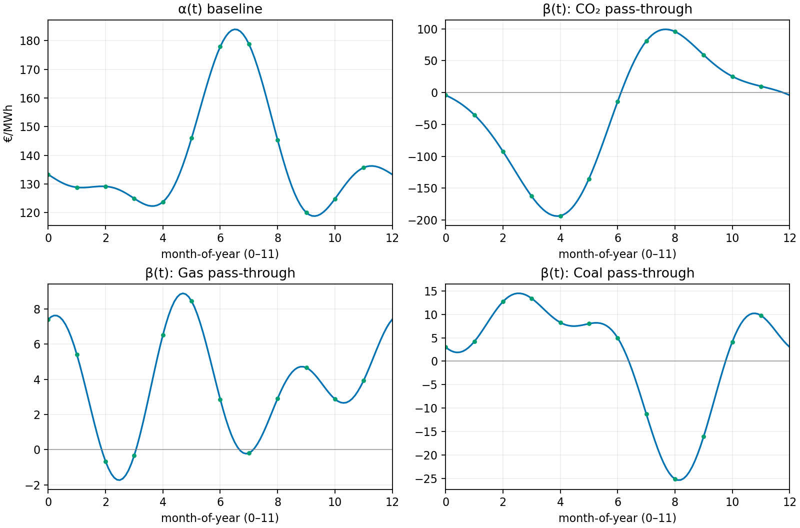

# Task 1 — Day ahead prices ~ commodities

> **Question:**  
> Suppose that you want to understand the influence that key commodities, i.e., prices of
> natural-gas, coal, CO2 allowances have on day-ahead prices. Model and quantify these
> relationships, and suggest a potential trading strategy based on your findings.

## Model
A **concurrent functional linear regression** is fitted.  
Each observation is a **curve** over a calendar axis (e.g., hour-of-day or month-of-year), not a single row as in OLS. The model can be expressed as: 
$$y_t(u)=\alpha(u)+\sum_j \beta_j(u)\,x_{j,t}(u)+\varepsilon_t(u)$$
 Here, $u$ is the calendar position (daily, monthly, quarterly, etc). The coefficients $\beta_j(u)$ are **smooth curves**. Each $\beta_j(u)$ is the **pass-through** at the *same* $u$: if gas moves by 1 unit at $u_0$, price moves by about $\beta_{\text{Gas}}(u_0)$ units at $u_0$, all else equal.  
**This differs from OLS:** OLS uses one fixed coefficient per driver. The functional model lets the coefficient vary smoothly with time-of-day or season, which is more interpretable for power markets.

---

## Figure A — Hour-of-day coefficient curves

**How to read the curves:**
- $\alpha(u)$ is the **baseline price** shape. It shows typical intraday levels without commodity shocks.  
  *Example:* baseline is low at night (~€105/MWh around 02:00), has a morning shoulder (~€135/MWh around 06:00), and a strong evening peak (~€175–€180/MWh around 18–19).
- $\beta_{\text{Gas}}(u)$ is the **gas pass-through** by hour.  
  *Example:* $\beta_{\text{Gas}}(18)\approx 1.25$. If gas rises by €1/MWh at 18:00, the day-ahead power price at 18:00 rises by ≈€1.25/MWh (ceteris paribus). Around 06:00 it is ≈0.7; around 23:00 ≈0.5. Gas matters **more** in the evening peak.
- $\beta_{\text{CO2}}(u)$ is the **carbon pass-through** by hour.  
  *Example:* around 20:00 it peaks near ≈1.6; before dawn it is closer to ≈1.0. A higher carbon price lifts peak-hour power more, which is consistent with carbon-intensive units setting the margin in peak.
- $\beta_{\text{Coal}}(u)$ is the **coal pass-through** by hour.  
  It is small for most hours (near zero), slightly positive in late afternoon (~0.2), and near zero or slightly negative late evening. Coal is a **second-order** driver in this sample for intraday moves.

**What positive/negative/zero mean at hour $u$:**
- **Positive** $\beta_j(u)>0$: an increase in driver $j$ raises the day-ahead price **at the same hour**.  
- **Negative** $\beta_j(u)<0$: an increase in driver $j$ lowers the price at that hour (can happen if another correlated factor dominates).  
- **Zero** $\beta_j(u)\approx 0$: the driver has **no material linear effect** at that hour after controlling for the others.

---

## Figure B — Month-of-year coefficient curves

**How to read the curves (simple):**
- $\alpha(u)$ is the **baseline seasonal level**. It peaks in summer in this sample and is lower in early autumn.
- $\beta_{\text{CO2}}(u)$ changes **sign** across months.  
  *Interpretation:* when the curve is **positive**, higher EUA prices (Euro/ ton CO2) push up power more strongly that month; when **negative**, the month-level regression attributes an opposite association.  
- $\beta_{\text{Gas}}(u)$ varies by season.  
  It is larger in parts of winter and late spring, smaller around midsummer. This matches higher gas dependence in colder months and transitional periods.
- $\beta_{\text{Coal}}(u)$ is modest and smoother.  
  Coal contributes less than gas/carbon in most months.
---

## Strategy

**Peak-hour pass-through.**  
The hour curves show the strongest pass-through in the evening (about 18–20).  
Before the **day-ahead** auction, if gas or CO₂ are **up**, buy the evening hours. If they are **down**, sell the evening hours.  
Size the expectation with the hour betas:  
$$\widehat{\Delta \text{Power}}(u)=\beta_{\text{Gas}}(u)\,\Delta \text{Gas}+\beta_{\text{CO2}}(u)\,\Delta \text{CO2}.$$

Trade only when the expected move is clearly bigger than costs involved with the buy.

_Note: The way the electricit market for those things works is quiet new to me so my strategy, although I hope it's correct, it might be a bit too simple._

---

## Short answer (what was quantified)
- Hour curves show **strong** gas and CO₂ pass-through in **peak hours**; coal is **small**.  
- Month curves show **seasonal** pass-through, including sign changes for CO₂ at the month level.  
- These shapes give **hour-specific** and **month-specific** hedge ratios and trade filters that standard OLS cannot provide cleanly.
