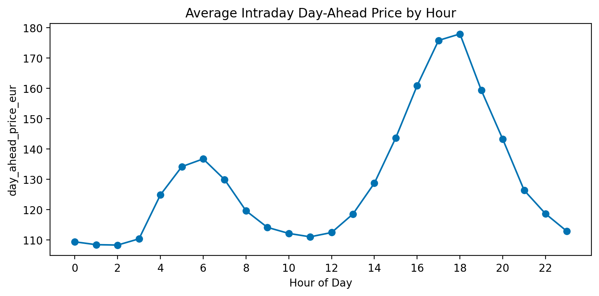
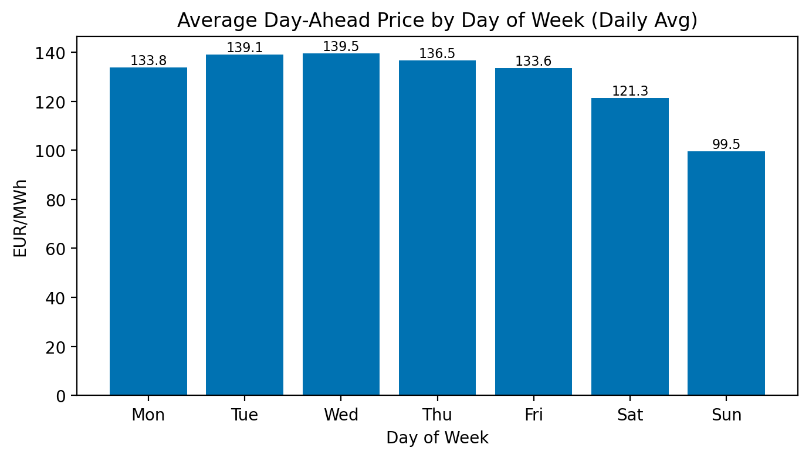

# Task 2 — Price Evolution, Trends, Seasonality

> **Question:**  
> Visualize the evolution of day-ahead power prices over time. Quantify the most obvious
> trends and provide possible explanations, e.g., seasonality, geopolitical factors etc. If
> possible, derive some non-trivial observations, that could inform traders better.

## Plots

### Daily averages with rolling means

**What it shows.**  
Prices are high and volatile during 2022. They fall and stabilize through 2023–2024. The 7-day and 30-day lines make the regimes clear.  
**Why:** This peaks shows the clear affect of the Russo-Ukrainian War had on electricity prices. Later in the analysis we discuver a downwards trend, showcasing that the market is still recovering from that spice.

---

### Intraday average by hour (0–23)

**What it shows.**  
A night trough (≈01–04). A morning shoulder (≈05–07). A strong evening peak (≈18–20).  
**Why:**  
- **Demand shape.** Usage is low at night, rises in the morning, and peaks in the evening. Solar fades after sunset.  
- **Marginal unit.** The last plant needed to meet demand sets the price. At night, cheaper units set it ⇒ lower prices and small pass-through. In the evening, gas often sets it ⇒ higher prices and larger $\beta_{\text{Gas}}(u)$ and $\beta_{\text{CO2}}(u)$.

---

### Month-of-year averages

**What it shows.**  
A seasonal cycle. Higher levels in summer in this sample. Lower levels in early autumn.  
**Why:** temperature, renewables, and hydro/wind vary by season.

---

### STL decomposition (monthly seasonality)

**What it shows.**  
- **Top panel:** monthly averages of day-ahead prices.  
- **Trend:** a smooth decline from 2022 into 2024.  
- **Season:** a clear annual cycle; stronger in 2022, more modest later.  
- **Resid:** short bursts that trend/season do not explain (notably early 2023).

## Quantification (short)
- **Regimes:** rolling means and the STL trend both show the 2022 → 2024 shift (high → lower/stable).  
- **Seasonality:** the **annual** cycle is visible and persistent.  
- **Intraday:** the evening peak (≈18–20) remains the highest window in the intraday profile.

## Non-trivial observations
- **Evening peak dominance.** Fuel and scarcity shocks bite most in the evening hours.  
- **Weekend discount.** Weekends price is lower than weekdays (see `plot_dow_daily_avg.png`) due to possibly weaker industrial demand.

## Files referenced
- `task2/plot_daily_avg_with_rollings.png`  
- `task2/plot_intraday_by_hour.png`  
- `task2/plot_month_of_year_avg.png`  
- `task2/stl_monthly_period12.png`