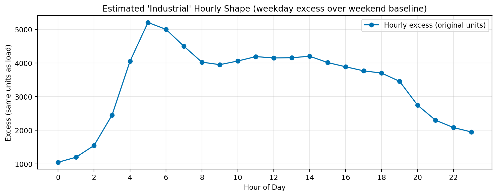
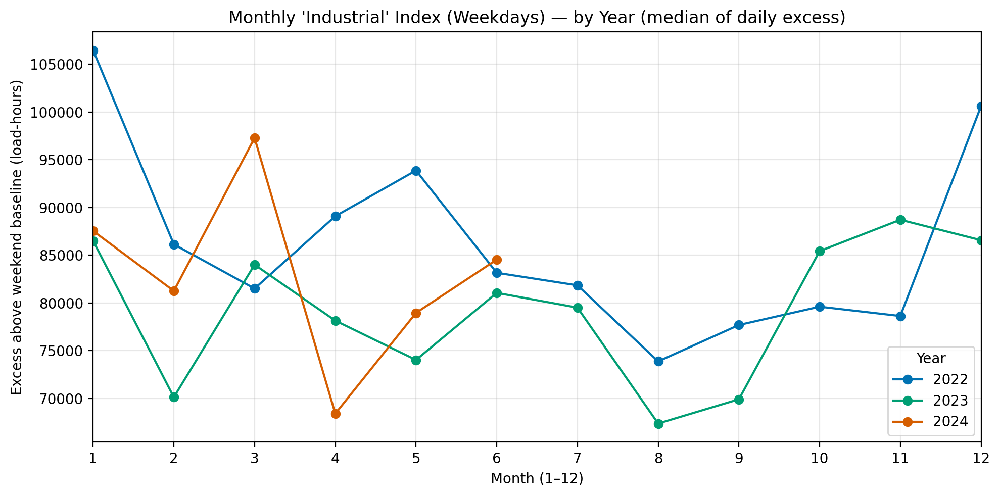

# Task 3 — Load Profiles and an Industrial Proxy

> **Question:**  
> Develop a detailed analysis of the Polish electricity load profile by identifying distinct
> patterns and how they have changed throughout time. Visualize the typical weekday
> and weekend load profile. Moreover, given the aggregate hourly load data, isolate the
> power load profile of the Polish industrial sector.

## What was done (short)
- The hourly load series from `clean_data.csv` is split into **weekdays** and **weekends**.  
- Typical profiles are shown with medians and IQR (25–75%).  
- **Load velocity** is computed as the hour-to-hour change and plotted for weekdays and weekends.  
- An **industrial proxy** is built as weekday load **above** a weekend baseline at the same month and hour.

**Industrial method (concise math).**  
Weekend baseline by month and hour:  
$B_{m,h}=\operatorname{median}\{\text{Load}_t:\ t\ \text{is weekend},\ \text{month}(t)=m,\ \text{hour}(t)=h\}.$

Weekday “excess” at time $t$ (month $m$, hour $h$):  
$E_t=\text{Load}_t - B_{m,h}$

---

## Plots

### Weekday vs Weekend profiles by year

**What it shows.**  
Weekdays sit **above** weekends and have a stronger **morning ramp** and **evening plateau**.  
Weekends are **lower** and **flatter**. The shaded IQR shows that profiles shift across years very little.

---

### Load velocity (Δ per hour) — weekdays vs weekends

**How it is computed.**  
Velocity is the hour-to-hour change: $\Delta L_t = L_t - L_{t-1}.$  
For each hour of day, the medians (and IQR) of $\Delta L_t$ are taken by **year** and **weekday/weekend**.

**What it shows.**  
- **Weekdays:** a sharp positive spike around **05–06** (morning ramp), near-zero around **midday**, and a large **negative** spike around **19–20** (evening drop).  
- **Weekends:** the same pattern but **smaller** ramps.  
- Year lines show that ramp **sizes** shift across **2022–2024**.

**Why it helps.**  
Level plots show *how high* load is. Velocity shows *how fast* it moves.  
This adds information on **ramping risk**, **flexibility needs**, and when the system is most sensitive to shocks.

---

### “Industrial” hourly shape (weekday excess over weekend baseline)

**What it shows.**  
Excess load is near **zero at night** and concentrated in **working hours**.  
This gives a simple, transparent **industrial profile** from aggregate data.

**Limitations and a cleaner option.**  
This proxy is **crude**. It assumes weekends are “non-industrial” baselines.  
A more precise approach would use **“hard holidays”** (e.g., **1 Jan**, **Christmas**, **Easter Sunday**, **Labour Day**).  
On those days almost everything is closed, so what remains should be the **24/7 industrial** load plus a small set of other always-on uses.  
That holiday baseline could replace (or calibrate) the weekend baseline.  
This refinement was **not implemented due to time**.

---

### Monthly “industrial” index by year (median of daily excess)

**What it shows.**  
The index varies by **season** and **year**. It highlights months when industrial demand
stands **well above** the weekend baseline.

---

## Takeaways
- Weekdays are **higher and more peaked**; weekends are **lower and flatter**.  
- **Velocity** reveals **when** ramps occur and how **large** they are (stronger on weekdays).  
- The **industrial proxy** isolates working-hour excess; a **holiday-based** baseline would make it cleaner.

## Files referenced (task folder)
- `task3/hourly_load_by_year_wd_we.png`  
- `task3/load_velocity_wd_we.png`  
- `task3/industrial_hourly_shape.png`  
- `task3/industrial_index_monthly_by_year.png`  
- (Tables: `weekday_daily_excess_matrix.csv`, `industrial_index_daily.csv`, `industrial_index_monthly_median.csv`)