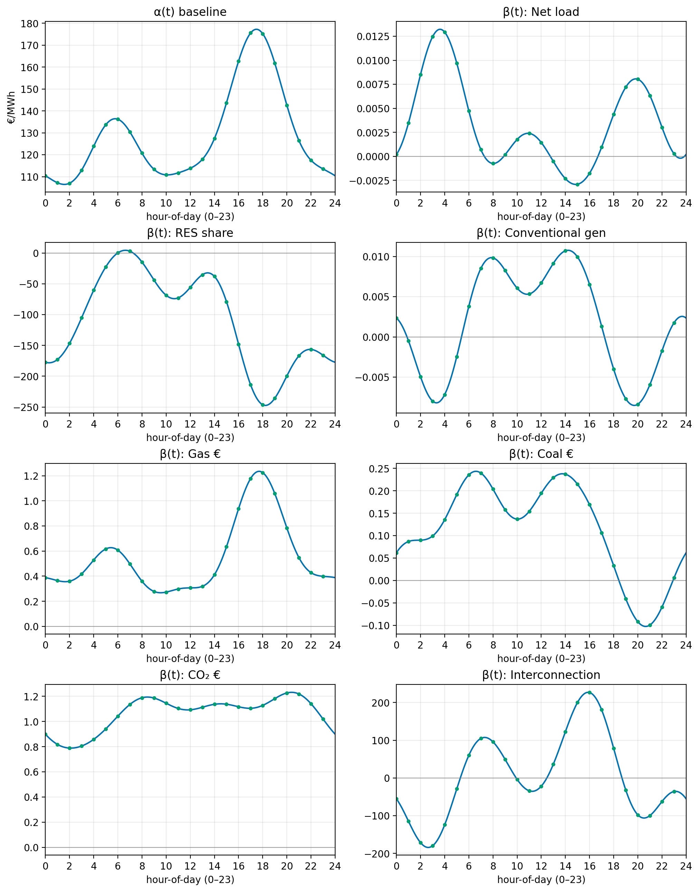
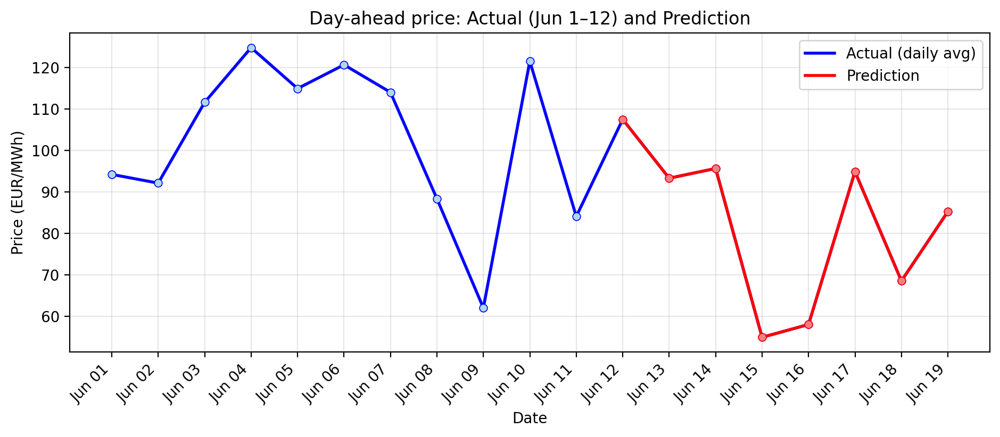

# Task 4 — Scenario Week & Price Prediction

> **Question:**  
> Build a simple forecasting setup. Apply scenario tweaks to the drivers and forecast day-ahead prices for a target week. Explain the setup and show the results.

## Window and scenarios
- **Target week:** 2024-06-13 → 2024-06-19 (UTC).  
- **Base for scenarios:** the **previous week** shifted forward by 7 days.
- **Tweaks applied to the base week:**
  1) **Solar +10%** (`solar *= 1.10`).  
  2) **Wind +210 MW** from 2024-06-13 onward (flat add to `wind`).  
     *Note:* 210 ≈ 300 MW × 70% utilization.  
  3) **Cold surge at night:** add **+15% total** load across hours **00–06** each night.

## Explanatory variables and rationale
The model uses a **small, engineered set** to avoid multicollinearity (see Task 1 discussion):

- **`net_load`** = total load minus wind/solar.  
  *Why:* proxies the demand that must be met by thermal/expensive units. Reduces overlap with renewables.
- **`renewable_share`** = renewable generation / total generation.  
  *Why:* A share is scale-free and less collinear with level variables.
- **`conventional_gen`** = aggregated thermal output.  
  *Why:* availability/commitment of thermal fleet without splitting into many highly correlated series.
- **`ngas_price_eur_mwh`, `coal_price_eur_ton`, `co2_price_eur_ton`**.  
  *Why:* core exogenous drivers of marginal cost (fuel and carbon).
- **`interconnection_share`** = net imports / load.  
  *Why:* scarcity relief or stress from cross-border flows, normalized by system size.

**Why not “use everything”?**  
Many raw columns move **together** (load, conventional gen, imports/exports, wind, solar, etc.).  
Feeding all of them into least squares makes the **betas unstable** and hard to read; tiny data changes flip signs.  
Using **shares**, **net** quantities, and **aggregates** keeps the model **parsimonious** and the hour-by-hour coefficient curves **interpretable**.

## Model
A **concurrent functional linear** model is fitted on **hour-of-day** curves.  
For hour $t\in\{0,\dots,23\}$:  
$P(t)=\alpha(t)+\sum_j \beta_j(t)\,X_j(t)+\varepsilon(t).$
- Rows are **days**; columns are **hours**.  
- Predictors are **centered by hour**.  
- Curves are smoothed with a **Fourier basis** (K=9).  
- Train on **all data** except the target week.  
- Predict the target week using the **scenario** drivers.

## Coefficient shapes (hour-of-day)

**Reading:** $\alpha(t)$ is the baseline profile. $\beta_j(t)$ are hour-specific pass-throughs for the engineered drivers. Larger $\beta_j(t)$ ⇒ stronger effect **at that hour**.

## Result — actual vs prediction (daily averages)

**What it shows.**  
- **Blue line:** realized daily averages **before** the scenario week (2024-06-01 → 2024-06-12).  
- **Red line:** **predicted** daily averages **for** 2024-06-13 → 2024-06-19 under the scenario.  
- The vertical split marks the move from actuals to predictions.

## Prediction table (daily averages)

Values from `task4/predictions_daily.csv` for the scenario week.

| Metric                             | Thu 13 Jun | Fri 14 Jun | Sat 15 Jun | Sun 16 Jun | Mon 17 Jun | Tue 18 Jun | Wed 19 Jun |
|------------------------------------|-----------:|-----------:|-----------:|-----------:|-----------:|-----------:|-----------:|
| Predicted day-ahead avg (€/MWh)    |    93.25   |   95.60    |  54.88     |   57.96    |    94.83   |   68.47    |    85.20   |

## Files referenced
- Tables: `task4/train_set.csv`, `task4/test_set.csv`, `task4/predictions_daily.csv`, `task4/model_basis_weights.csv`, `task4/combined_actual_and_prediction.csv`, `task4/actual_daily.csv`  
- Plots: `task4/coefficients_alpha_beta.png`, `task4/actual_vs_prediction.png`

## Notes and limits
- Effects are **concurrent** (no lag/lead). Cross-hour dynamics are not modeled.  
- The night **+15%** load uplift is a **distributed** uplift (00–06). A fuller approach could build **seven** scenario datasets (each night chosen in turn), score each, and **average** the results to reflect timing uncertainty.  
- A **single** model is shown here for clarity. For production, an **ensemble** with weights tuned by cross-validation would be more robust.